# 效果图
<div>

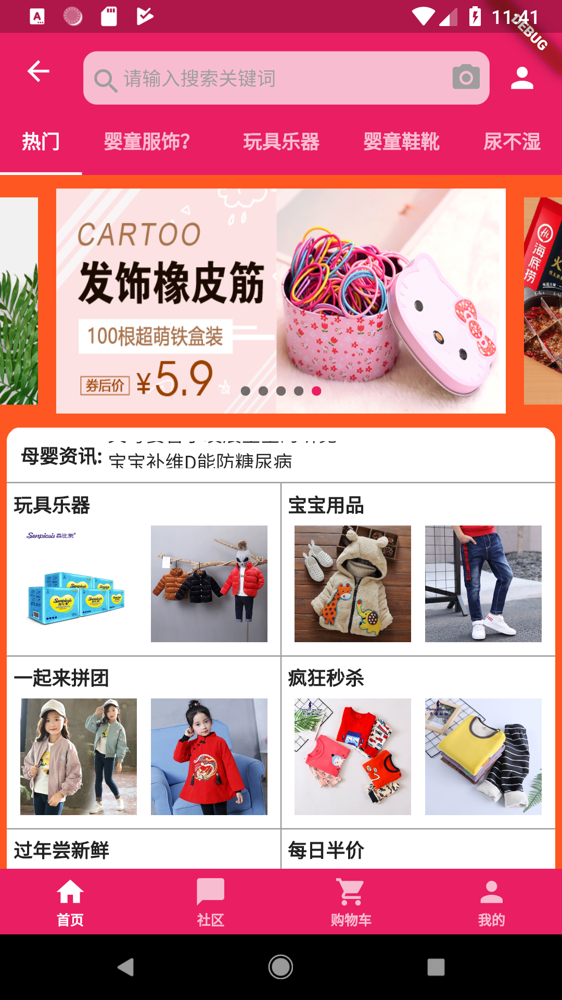
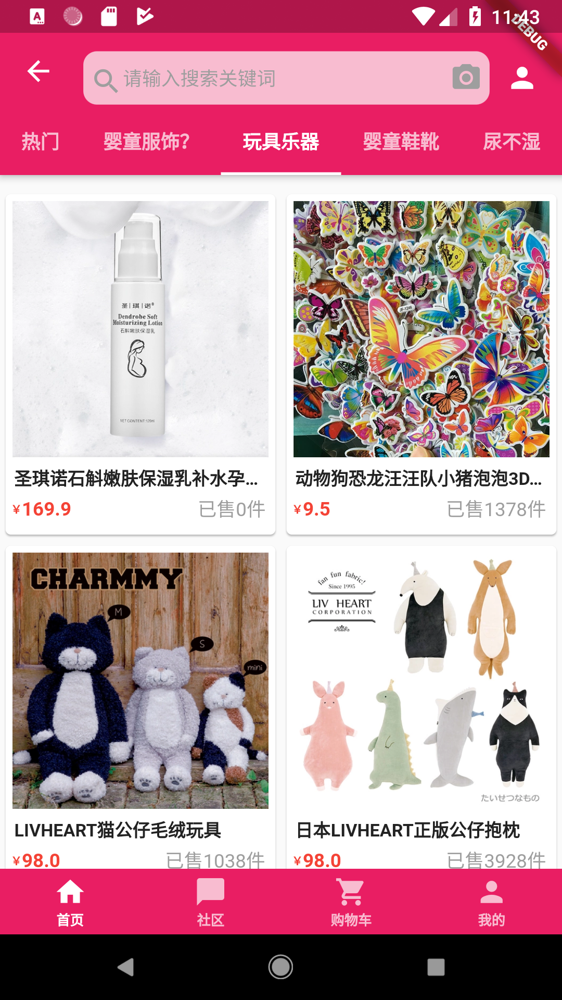
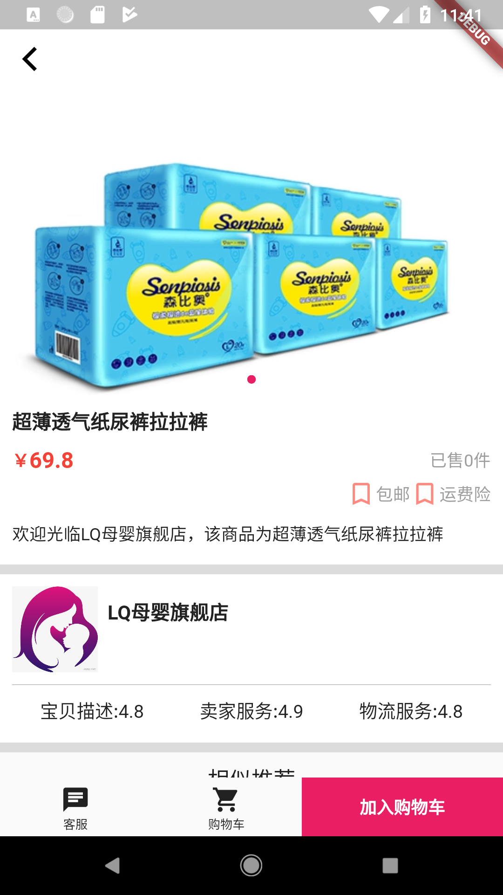
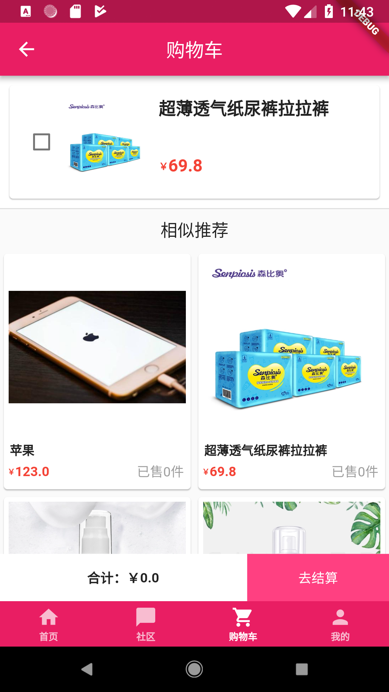
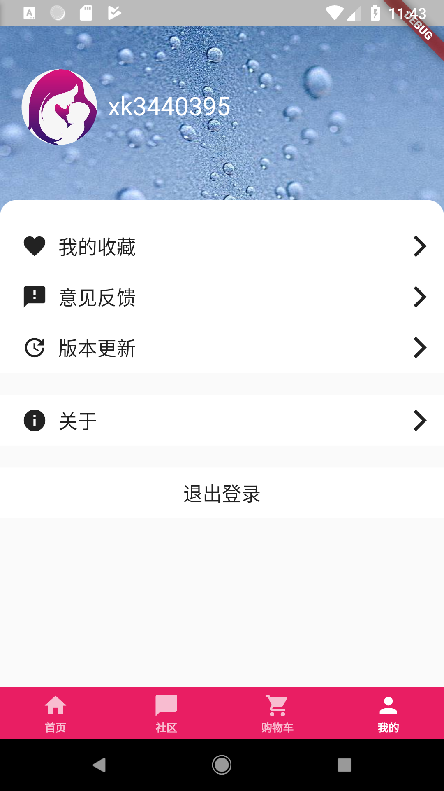
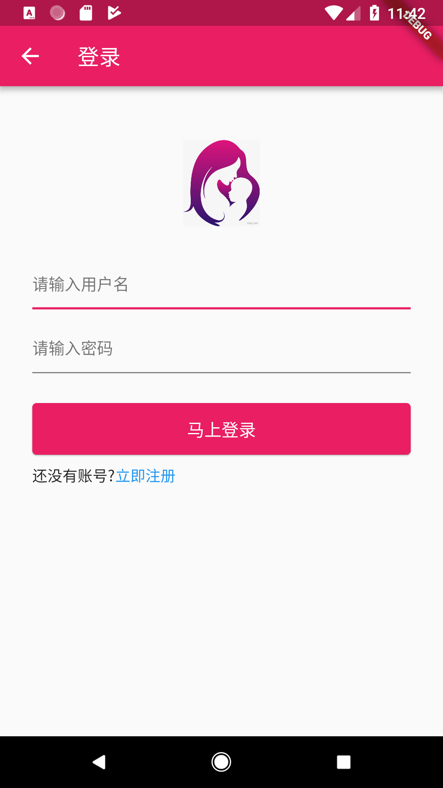
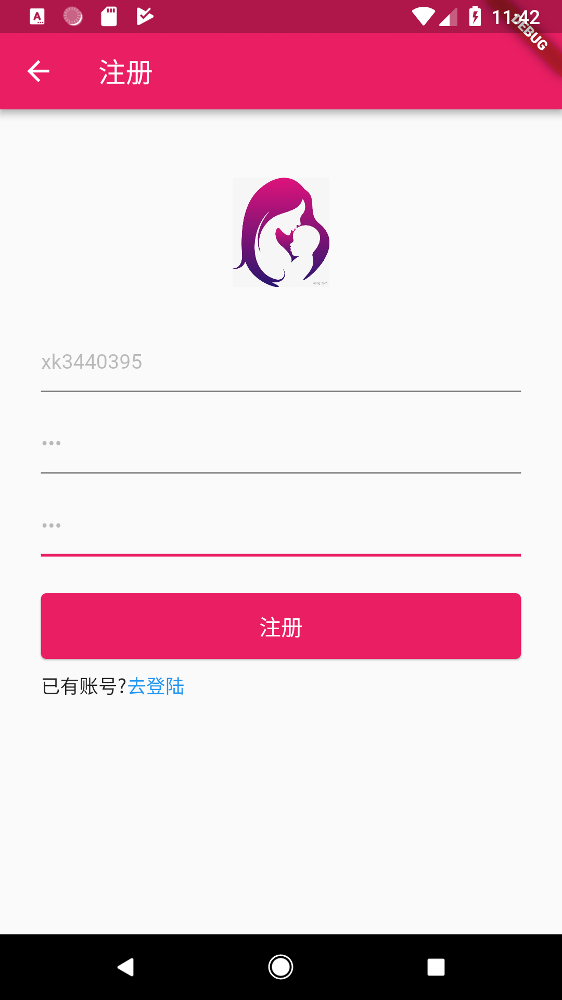
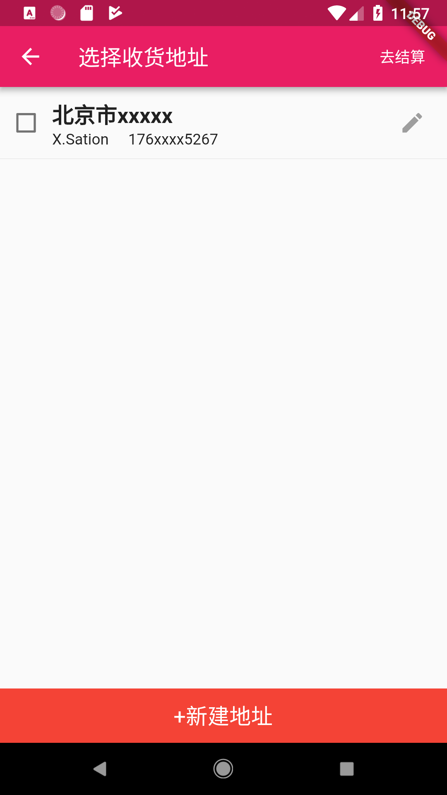
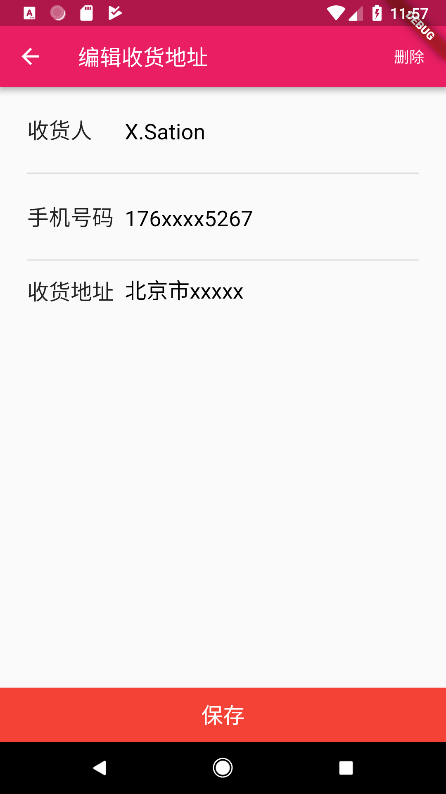
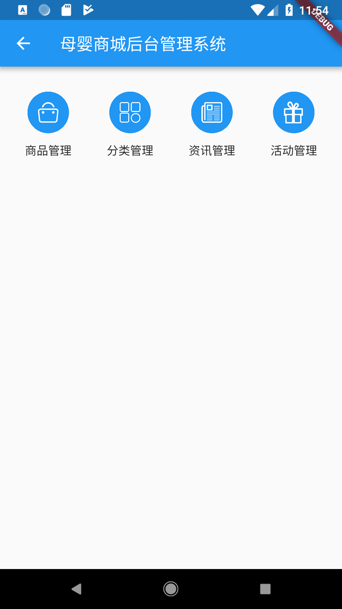
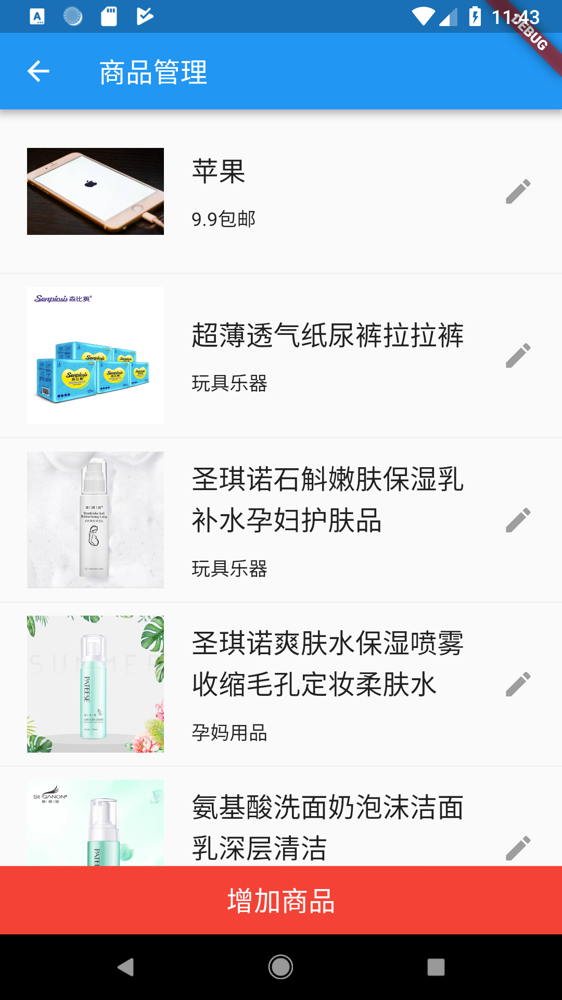
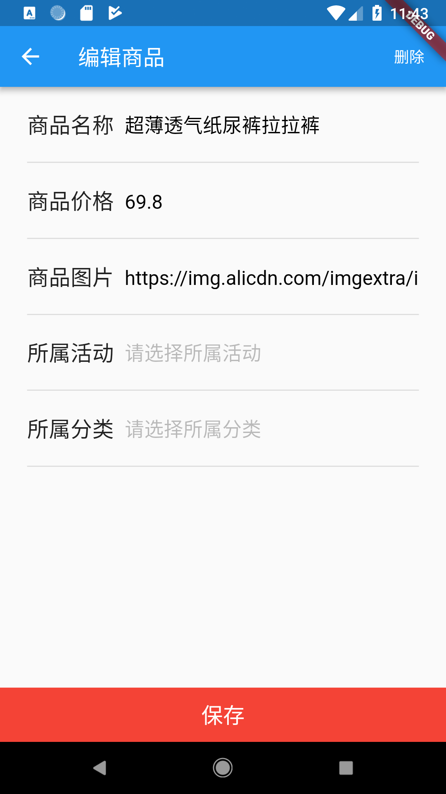
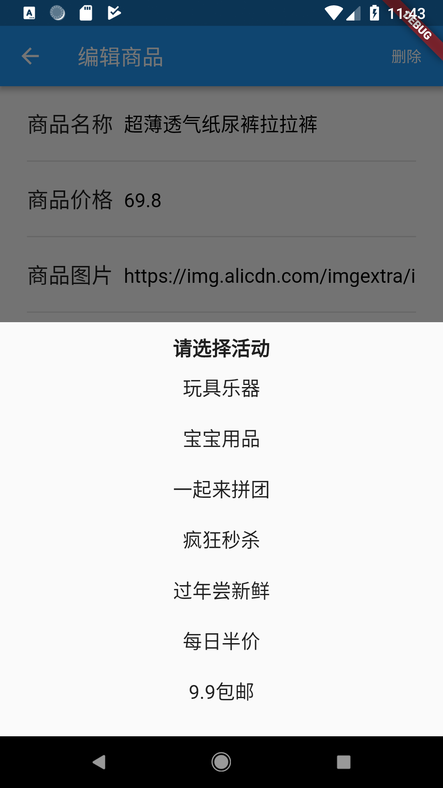
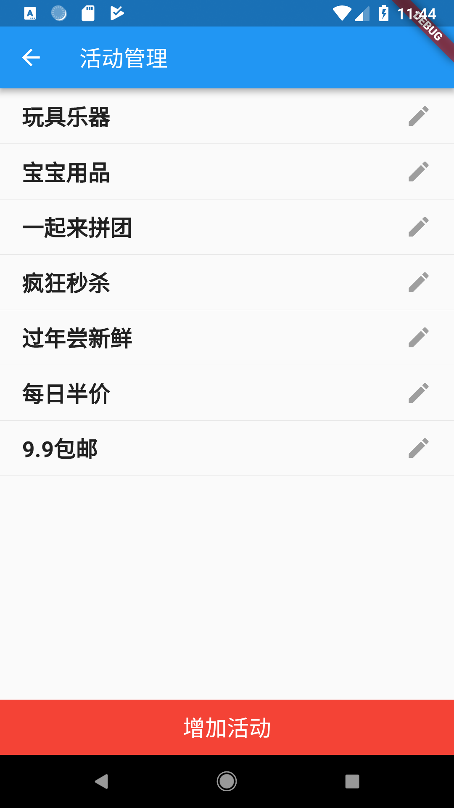
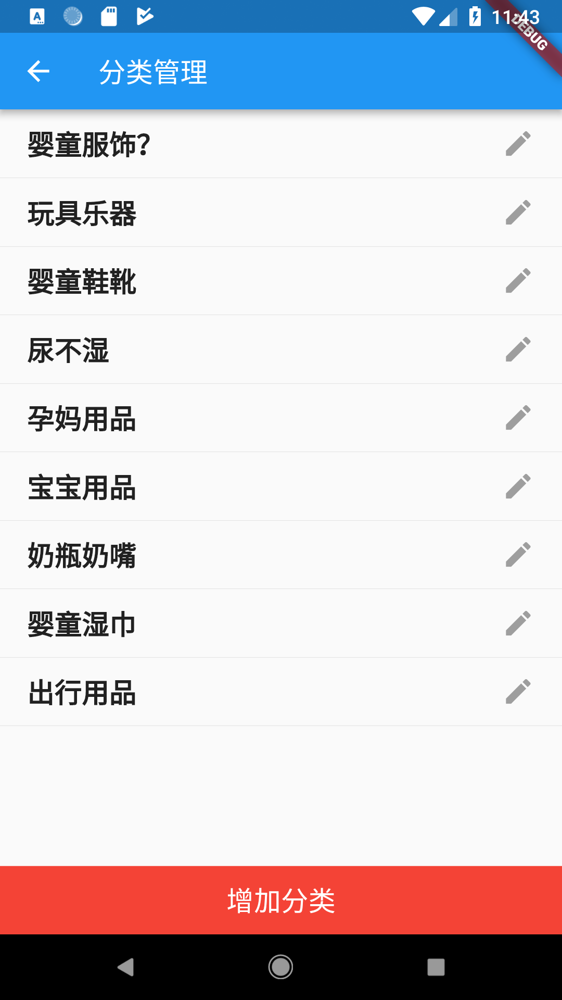
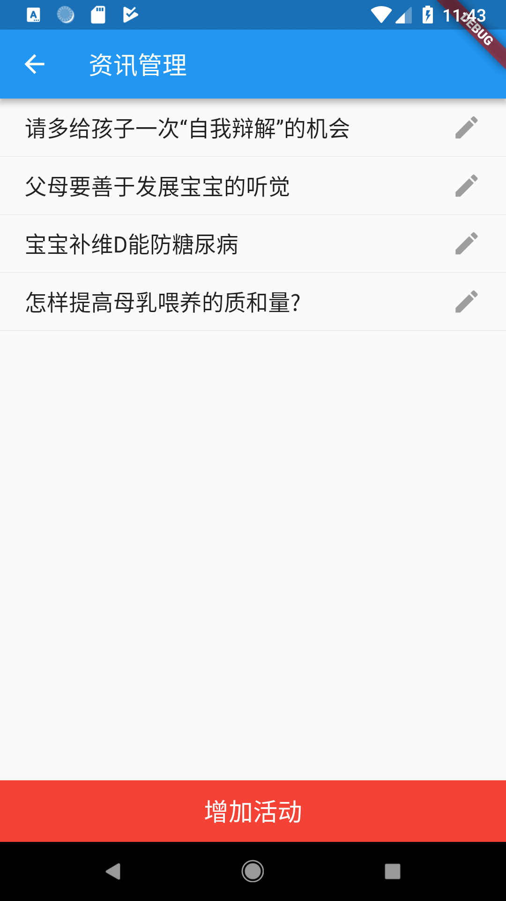
</div>  
# 造数据
      
## 使用app的后台管理系统

app直接操作

## 使用postman批量添加数据                     
1. 首页-热门-资讯

   post请求，向 http://localhost:8080/api/addHotNews以body形式提交json

   ```json
   [
      {"news": "怎样提高母乳喂养的质和量?"},
      {"news": "宝宝补维D能防糖尿病"}, 
      {"news": "父母要善于发展宝宝的听觉"}, 
      {"news": "请多给孩子一次“自我辩解”的机会"}
   ]
   ```
2. 首页-热门-轮播图

   post请求，向 http://localhost:8080/api/addHotBanner以body形式提交json
   
   url为轮播图的url，jump_value为点击跳转详情页后，对应的商品的id

   ```json
   [
      {
         "jump_value": "18124465",
         "url": "https://img.alicdn.com/imgextra/i4/2508158775/O1CN01ZzQNwe2EgzyK8XdVW_!!2508158775.jpg"
      },
      {
         "jump_value": "18174928",
         "url": "https://img.alicdn.com/imgextra/i4/2508158775/O1CN01gRLxMq2EgzyJOlFoX_!!2508158775.jpg"
      },
      {
         "jump_value": "18135333",
         "url": "https://img.alicdn.com/imgextra/i4/2508158775/O1CN01Bw411k2EgzyMxZ4m3_!!2508158775.jpg"
         
      },
      {
         "jump_value": "18144384",
         "url": "https://img.alicdn.com/imgextra/i3/2508158775/O1CN01VTo1YY2EgzyMBGSwI_!!2508158775.jpg"
      },
      {
         "jump_value": "18189644",
         "url": "https://img.alicdn.com/imgextra/i1/2508158775/O1CN01q1sXeN2EgzyMlNvd7_!!2508158775.jpg"
      }
   ]
   ```   

3. 首页-热门-活动数据

   post请求，向 http://localhost:8080/api/addHotPromotion以body形式提交json

   在首页-热门-资讯下面以两个商品一组的形式展示。
   添加商品时，可以通过指定promotionId来指定所属的活动。每个活动会展示两个商品。

   ```json
   [
      {
         "title": "9.9包邮"
      },
      {
         "title": "每日半价"
      },
      {
         "title": "过年尝新鲜"
      },
      {
         "title": "疯狂秒杀"
      },
      {
         "title": "一起来拼团"
      },
      {
         "title": "宝宝用品"
      },
      {
         "title": "玩具乐器"
      }
   ]
   ```

4. 首页-tab

   post请求，向 http://localhost:8080/api/addCategory以body形式提交json

   默认会在首页展示一个热门tab，里面展示了轮播图、资讯、活动以及所有的商品列表。

   之后每个tab展示这个tab分类下的商品。在添加商品的时候，可以指定商品所属的tab分类。

   ```json
   [{
      "categoryName": "婴童服饰"
   }, {
      "categoryName": "玩具乐器"
   }, {
      "categoryName": "婴童鞋靴"
   }, {
      "categoryName": "尿不湿"
   }, {
      "categoryName": "孕妈用品"
   }, {
      "categoryName": "宝宝用品"
   }, {
      "categoryName": "奶瓶奶嘴"
   }, {
      "categoryName": "婴童湿巾"
   }, {
      "categoryName": "出行用品"
   }]
   ```

5. 商品

   post请求，向 http://localhost:8080/api/appProducts以body形式提交json

   每个商品可以指定销量、价格、图片、名称、所属分类、所属活动。

   下面是一个示例，我整理了一套商品数据，可以直接添加他们。（注意，添加的时候最好用文本编辑工具替换一下categoryId、promotionId的值，具体根据数据库中分类、活动的真实id来做，我给的数据中，分类id、活动id指定了1、2、3、4。。。具体还得看你数据库中真实的分类、活动的id，或者嫌麻烦，可以通过客户端的后台管理系统手动修改。有任何疑问可以提issue）

   数据地址：https://github.com/kaikaixue/MuYingMallProject/blob/master/data/products.json

   ```json
   [
    {
        "sell_num": 68,
        "original_price": 19.9,
        "image": "https://gd1.alicdn.com/imgextra/i1/2957562192/TB27Mn4G4SYBuNjSsphXXbGvVXa_!!2957562192.jpg_480x480.jpg_.webp",
        "title": "依卫湿巾10片X30包迷你随身装",
        "categoryId": 1,
        "promotionId": 2
    },
    {
        "sell_num": 99,
        "original_price": 69.9,
        "image": "https://img.alicdn.com/imgextra/i2/838547268/O1CN01CHf1DQ23Yn6GTi9Zs_!!838547268.jpg_480x480.jpg_.webp",
        "title": "眯眯熊婴儿拉拉裤护理型成长裤L52片",
        "categoryId": 0,
        "promotionId": 0
    } 
   ]
   ```


# 问题

### 数据库编码

1. 保证数据库编码
   1. use某个数据库之后再查看。因为mysql可以为每个数据库指定不同的编码
   2. 创建数据库时即指定编码
      - `CREATE DATABASE mall DEFAULT CHARACTER SET utf8 COLLATE utf8_general_ci;`
      - 亦可通过修改配置文件、修改数据库内容等方式修改，详情参考https://blog.csdn.net/u012410733/article/details/61619656
   3. 使用`show variables like '%char%';`校验
   4. 用命令插入、查询校验中文问题是否解决
   5. 首先要保证命令窗口的文本编辑是否使用了utf-8
2. 保证代码层面的编码
   1. ide的文本是否使用了utf-8
3. 数据库连接使用utf-8
   1. `jdbc:mysql://localhost:3306/mall?useUnicode=true&characterEncoding=utf-8`

### 端口占用

- mac
  - sudo lsof -i :8080 查看端口占用进程
  - sudo kill -9 81881 杀进程                                                                   
